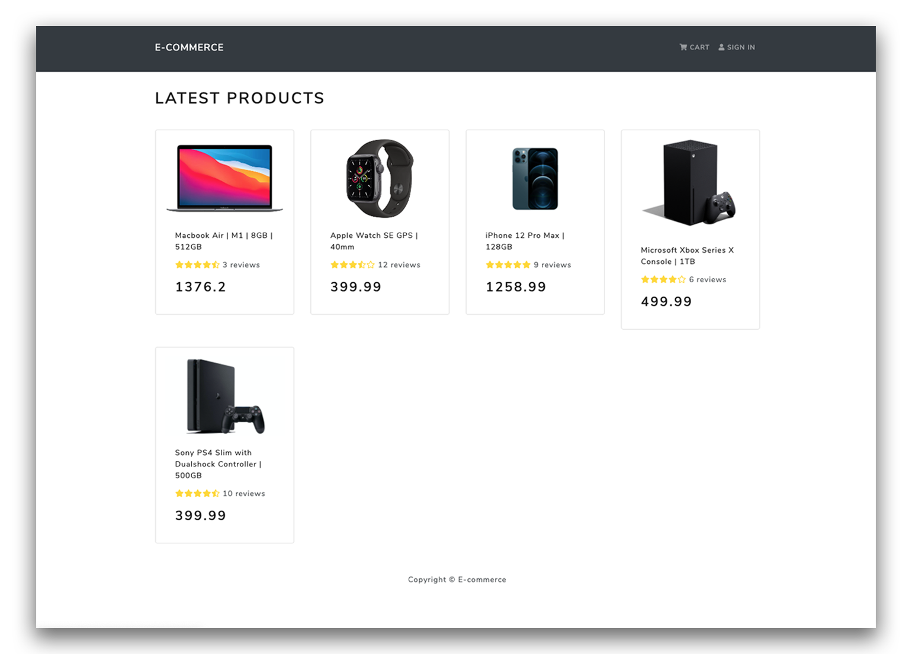

# E-commerce-MERN

## E-commerce website built on the MERN stack
    * Node.js API 
    * React Frontend
    * MongoDB 

      - Secure Authentication with JWT - Sign up/Login
      - Cart functionality 
      - Checkout with PayPal
      - User profile and orders
      - Admin panel with CRUD functionality for products and users

  

TODO: Finish edit products and orders. Add Multer for product image upload.

### Config to run:
  - Change ".env copy" file to your own values and rename to ".env"
  - Seed Database with `npm run data:import`
  - Run app with `npm start`